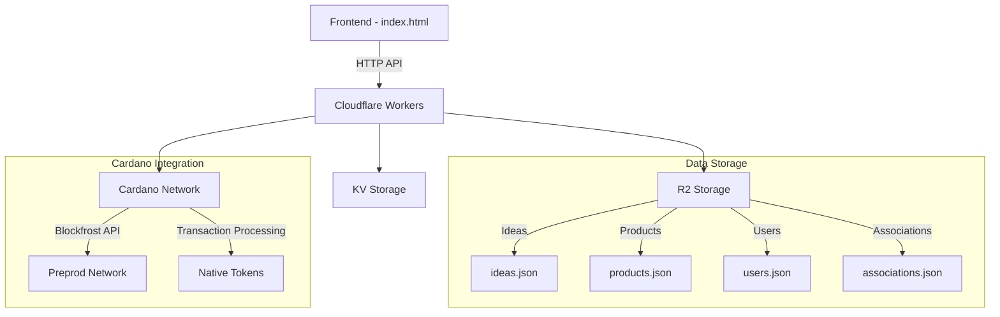

# Cloudflare Backend Implementation Plan

## Overview
This document outlines the implementation plan for the Cloudflare Workers backend for the Soil platform, based on the existing frontend and specifications.

## Architecture Overview

## Required Files and Configuration

### 1. Core Files
- `worker.js` - Main Cloudflare Workers script
- `wrangler.toml` - Cloudflare Workers configuration
- `package.json` - Dependencies and scripts

### 2. Environment Variables
- `BLOCKFROST_API_KEY` - Blockfrost API key for Cardano integration
- `ADMIN_WALLET_ADDRESS` - Master wallet address for admin functions
- `INTERMEDIARY_WALLET_SEED` - Seed phrase for intermediary wallet
- `NFT_POLICY_ID` - Policy ID for identity NFTs
- `BIT_TOKEN_POLICY_ID` - Policy ID for bit tokens
- `ASSET_POLICY_ID` - Policy ID for asset shares

### 3. R2 Buckets
- `soil-data` - Main storage bucket for JSON files
- `soil-metadata` - IPFS metadata storage

### 4. KV Namespaces
- `SOIL_SECRETS` - Encrypted storage for sensitive data
- `SOIL_CACHE` - Caching for frequently accessed data

## API Endpoints

### Authentication
- `POST /auth/login` - User login
- `POST /auth/register` - User registration
- `GET /auth/verify` - Verify user session

### Ideas
- `GET /ideas` - List all ideas
- `POST /ideas` - Submit new idea
- `GET /ideas/:id` - Get specific idea
- `PUT /ideas/:id` - Update idea (owner only)

### Products
- `GET /products` - List all products
- `POST /products` - Create new product
- `GET /products/:id` - Get specific product
- `PUT /products/:id` - Update product (owner only)

### Admin Functions
- `POST /admin/associate` - Associate idea with product
- `POST /admin/mint-nft` - Mint identity NFT for user
- `GET /admin/verified-users` - List verified users

### Cardano Operations
- `POST /transactions/mint-bit` - Mint bit tokens (verified users)
- `POST /transactions/transfer-anonymous` - Anonymous bit transfer
- `POST /transactions/burn-for-asset` - Burn bits for asset shares
- `GET /transactions/status/:txHash` - Check transaction status

## Implementation Phases

### Phase 1: Basic Setup
1. Initialize Cloudflare Workers project
2. Set up R2 buckets and KV namespaces
3. Configure environment variables
4. Create basic routing structure

### Phase 2: Data Storage
1. Implement R2 storage operations
2. Create JSON file management utilities
3. Add data validation and sanitization
4. Implement caching with KV

### Phase 3: Cardano Integration
1. Set up Blockfrost client
2. Implement transaction building utilities
3. Create wallet management system
4. Add transaction monitoring

### Phase 4: Core Features
1. User authentication system
2. Idea and product CRUD operations
3. Admin association functionality
4. Cardano transaction endpoints

### Phase 5: Security & Optimization
1. Rate limiting implementation
2. Input validation and sanitization
3. Error handling and logging
4. Performance optimization

## Security Considerations

### Rate Limiting
- 100 requests per minute per IP
- 10 transactions per hour per user
- 5 anonymous transfers per hour

### Validation
- Input sanitization for all endpoints
- Wallet address validation
- Transaction amount limits
- File size restrictions

### Encryption
- Sensitive data encrypted in R2
- API keys stored in KV with encryption
- Transaction metadata encrypted

## Testing Strategy

### Unit Tests
- Individual endpoint testing
- Transaction building validation
- Data storage operations

### Integration Tests
- Full API flow testing
- Cardano transaction end-to-end
- Frontend-backend integration

### Load Testing
- Concurrent user simulation
- Transaction throughput testing
- Storage performance validation

## Deployment Checklist

- [ ] Configure wrangler.toml with correct settings
- [ ] Set up environment variables in Cloudflare dashboard
- [ ] Create R2 buckets and KV namespaces
- [ ] Deploy worker with `wrangler deploy`
- [ ] Test all endpoints with frontend
- [ ] Monitor logs and performance metrics
- [ ] Set up CI/CD pipeline

## Next Steps

Once this plan is approved, we will:
1. Switch to code mode to implement the actual files
2. Create the complete worker.js with all endpoints
3. Set up the deployment configuration
4. Test the integration with the existing frontend